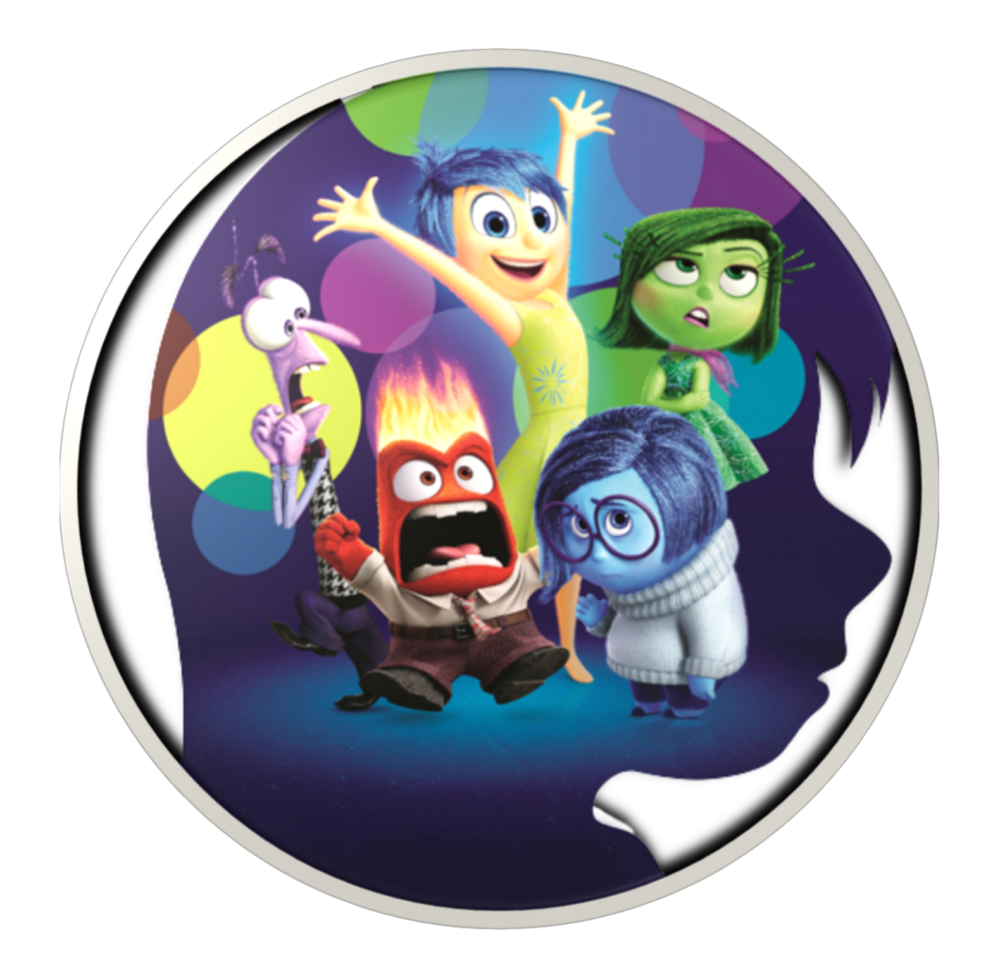

<h1 align="center">Reconhecimento de Emoções na Voz </h1>

 

## Links

- Google Colab Notebook - [Reconhecimento de Emoções na Voz.ipynb]([GOOGLE_COLAB]_Speech_Emotion_Recognition_Project.ipynb)

## Fonte dos dados: emoUERJ

A base de dados emoUERJ foi desenvolvida na Universidade Estadual do Rio de Janeiro (UERJ) com o principal objetivo de desenvolver modelos de Speech Emotion Recognition (SER; Reconhecimento de emoções na voz) em português, uma vez que existem poucas bases de dados nesse idioma. Na emoUERJ é possível encontrar:

- 377 arquivos de áudio (tamanho total: 105.1 MB)
- O banco de dados contém 8 atores, igualmente divididos entre os gêneros

Foram disponibilizadas 10 frases e eles tiveram a liberdade de escolher as frases para gravação dos áudios

Emoções alvo e total de áudios:

- Felicidade: 91
- Raiva: 94
- Tristeza: 100
- Neutro: 92
  
Abaixo seguem as 10 frases utilizadas neste dataset:

- Não importa quem está certo.
- Você perde tempo demais com a Internet.
- A garrafa está na geladeria.
- Eu estou me sentindo doente hoje.
- Eu estou um pouco atrasado.
- Nos fins de semana, eu sempre ia para a casa dele(a).
- De quem são essas malas que estão debaixo da mesa?
- Ele volta na quarta-feira.
- Já chega! Eu vou tomar um banho e ir para a cama.
- Você poderia arrumar a mesa, por favor?

Cada arquivo de banco de dados corresponde a uma frase gravada por um ator expressando uma das quatro emoções e foi nomeado da seguinte forma:
- Posição 1: gênero do ator ('m' para homem ou 'w' para mulher)
- Posições 2 e 3: id do ator (de 01 a 04)
- Posição 4: emoção (h: felicidade, a: raiva, s: tristeza, n: neutro)
- Posições 5 e 6: identificação da gravação

Por exemplo, o arquivo 'w04a11' foi o décimo primeiro áudio gravado pela atriz 04 interpretando a emoção da raiva.

Fonte: https://zenodo.org/record/5427549#.ZDI6jnbMLrf

## Visualizando a distribuição

Ao observar a quantidade de arquivos para cada classe fica evidente que temos um dataset razoavelmente balanceado.

 
 
## Espectrogramas de MFCC (Coeficientes Cepstral de Frequência Mel)
  
Os espectrogramas são parte fundamental da nossa aplicação, pois, através deles, podemos observar o áudio em três domínios: 
- Tempo
- Frequência
- Amplitude
  

 
 
 O espectrograma nada mais é do que um conjunto de características extraídas do áudio e, por meio dessas características, podemos visualizar o gráfico acima.

Quando pensamos em aplicações de Machine Learning voltadas para áudio, a escala mel é muito relevante, já que ela imita as características únicas perceptíveis pelo ouvido humano. Ex: é muito mais fácil nós identificarmos a diferença de 100Hz-200Hz do que 10.100Hz-10.200Hz.

Agora que já compreendemos o que é um espectrograma e o que faz a escala mel, podemos concluir que os espectrogramas nada mais são do que imagens. Logo, podemos treinar uma rede neural convolucional para que ela aprenda a classificar os diferentes tipos de som baseada nas diferenças dos espectrogramas mfcc.

## Espectrogramas de STFT (Short Time Fourier Transform)

 
 
 ## Modelo: Rede Neural Convolucional (CNN)

Os espectrogramas extraídos dos arquivos de áudio são como imagens 2D, então, podemos usar técnicas de classificação de imagens neles, ou seja, Redes Neurais Convolucionais (CNN).

A arquitetura desta rede neural foi definida com base em alguns testes realizados para obter o resultado esperado. A estrutura pode ser ajustada livremente e comparada aos resultados desta estrutura.

 * Parâmetros:
  * `Sequential`, é a classe para criar a rede neural, pois uma rede neural nada mais é que uma sequência de camadas (camada e entrada, camadas ocultas, camada de saída);  
  * `kernel_size`, o tamanho do kernel (matriz) de convolução;
  * `activation`, função de ativação;
  * `input_shape`, na primeira camada este é o tamanho dos dados de entrada
  * Camada `MaxPooling1D`, que vai fazer a extração das características principais;
  * Camada `Conv1d`, uma rede neural convolucional que realiza a convolução ao longo de apenas uma dimensão;
  * Camada `Flatten`, para transformar de matriz em vetor;
  * Camada `Dense`, quando um neurônio de uma camada está ligado a todas os outros neurônios das outras camadas;
  * `Dropout`, técnica de regularização para diminuir o overfitting;
  * `padding='same'`, indica que adicionamos uma nova coluna composta por somente 0 (zeros) e utilizamos toda a imagem;
 
 ## Matriz de Confusão
 
 
 
  
Observando a matriz de confusão, podemos chegar as seguintes conclusões:
- 16 frases foram classificados corretamente na classe Felicidade
- 15 frases foram classificados corretamente na classe Neutra
- 17 frases foram classificados corretamente na classe Raiva
- 18 frases foram classificados corretamente na classe Tristeza
- 1 frase que deveria ter sido classificada na classe Felicidade, mas foi classificada na classe Raiva
- 1 frase que deveria ter sido classificada na classe Neutra, mas foi classificada na classe Felicidade
- 1 frase que deveria ter sido classificada na classe Neutra, mas foi classificada na classe Tristeza
- 4 frases que deveriam ter sido classificadas na classe Raiva, mas foram classificadas na classe Felicidade
- 1 frase que deveria ter sido classificada na classe Raiva, mas foi classificada na classe Neutra
- 2 frases que deveriam ter sido classificadas na classe Tristeza, mas foram classificadas na classe Neutra
  
 ## Classification Report
  
 Podemos observar que o modelo conseguiu performar bem e obteve uma acurácia de 87%.
  
 
 
 
Visualizando a taxa de acerto para cada uma das classes, podemos constar que:
- Um recall de 94% para classe Felicidade indica que o modelo consegue classificar corretamente 94% das frases da classe Felicidade e, quando isso acontece, ele tem 76% de precisão (precision)
- Um recall de 88% para classe Neutro indica que o modelo consegue classificar corretamente 88% das frases da classe Neutro e, quando isso acontece, ele tem 83% de precisão
- Um recall de 77% para classe Raiva indica que o modelo consegue classificar corretamente 77% das frases da classe Raiva e, quando isso acontece, ele tem 94% de precisão
- Um recall de 90% para classe Tristeza indica que o modelo consegue classificar corretamente 90% das frases da classe Tristeza e, quando isso acontece, ele tem 95% de precisão
  
 ## Próximos Passos
- Criação de uma API que utiliza o modelo
 
